# README.md

# 🧩 퍼즐 조각에 추억을 저장해보세요. Frazzle!

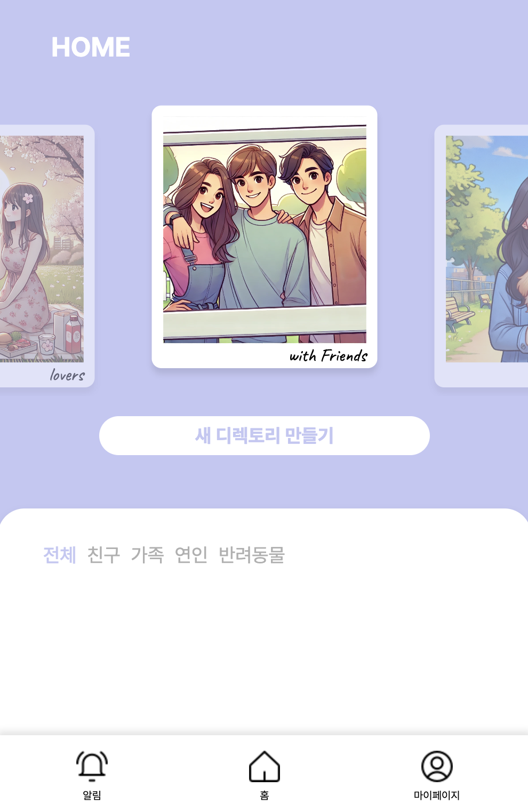

# Overview

소중한 추억들을 한 곳에 모아, 소중한 사람들과 함께하세요. 사진을 통한 퍼즐 게임으로 즐거운 시간을 보내며 더 많은 추억을 쌓아보세요.

# Frazzle 서비스 화면

### ■ 메인 페이지


### ■ 마이 페이지


### ■ 디렉토리 상세 페이지

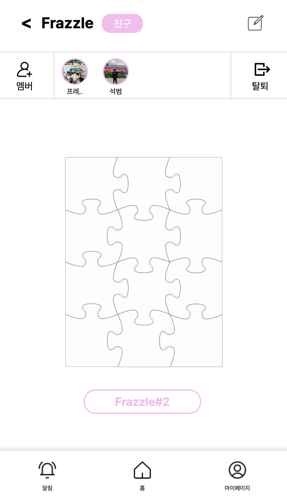

### ■ 퍼즐 상세 페이지


### ■ 게임 대기방 페이지


### ■ 인게임 페이지


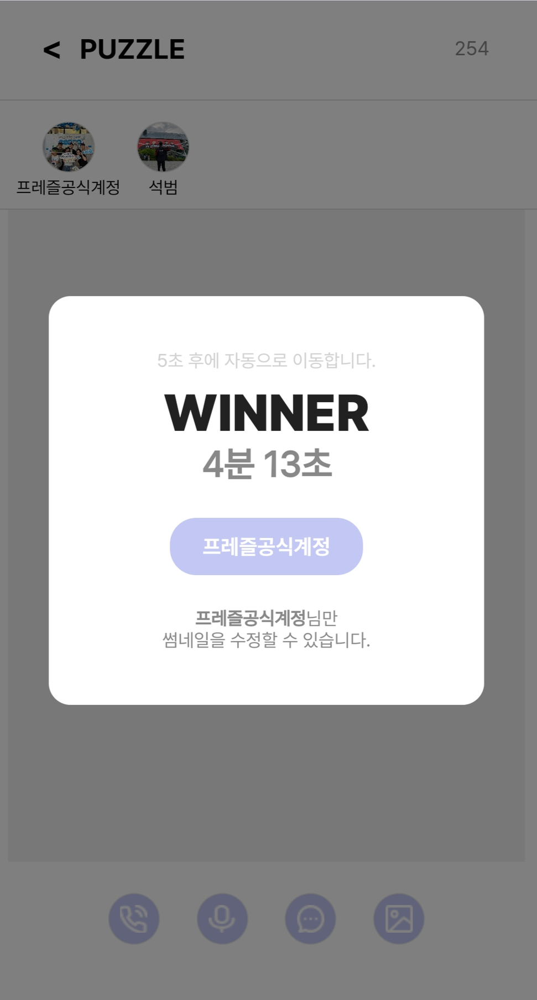

### ■ 사진 조회 페이지


### ■ 네컷 사진 생성 페이지


# 주요 기능

### 서비스 소개

- 누군가와 추억을 저장하는 것을 특별하게 생각하는 사용자를 위한 포토 앨범에 퍼즐 감성을 추가한 추억 저장 서비스

### 프로젝트 기능

- 추억 사진 공유 서비스
    - 다른 사용자를 초대하여 퍼즐판을 함께 기록할 수 있다.
- 사진 업로드 서비스
    - 퍼즐판의 퍼즐 조각에 사진을 올리고 멘트를 작성할 수 있다.
- 사진 저장 서비스
    - 업로드한 사진은 S3 클라우드를 통해 관리한다.
- 미션 가이드 서비스
    - 키워드를 최대 3개까지 등록하면 OpenAI API 를 통해 chat GPT가 목표 사진 장면을 추천해준다.
- 퍼즐게임 이미지 선정 서비스
    - VISION API를 이용하여 퍼즐판에 업로드된 사진 중 가장 인원이 많이 등록된 사진이 퍼즐 게임의 사진으로 선정된다.
- 경쟁 퍼즐 게임 서비스
    - WebSocket, WebRTC를 이용하여 퍼즐 게임 도중 메시지 채팅 및 음성 채팅을 할 수 있다.
- 추억 열람 서비스
    - 완성한 퍼즐판의 사진들을 swipe를 통해 감상할 수 있다.
- 네컷 사진 서비스
    - 퍼즐판 내 사진 중 4장의 사진을  선택하여 직접 커스텀한 네컷 사진을 다운로드 받을 수 있고 SNS에 공유할 수 있다.

---

### 개발환경

- OS
    - Local : Windows 10
    - AWS : Ubuntu 20.04.2 LTS
- IDE
    - IntelliJ IDE 2024.1.4
    - Visual Studio Code 1.90.2
- UI / UX
    - Figma
- Database
    - MySQL workbench 8.0.38 (Windows 10)
    - MySQL 8.0.29 (Ubuntu 20.04.2 LTS)
    - AWS S3
- API
    - Openai API
    - Vision API
- CI/CD
    - Jenkins

---

### 상세 스택

- Backend
    - JAVA - openjdk 17.0.12
    - Gradle 8.8
    - SpringBoot 3.3.2, JPA 3.3.2, Querydsl 5.1.0, Lombok 1.18.34, WebSocket 10.1.26
    - security, oauth-client2, jjwt 0.11.2
    - JUnit5
    - spring-cloud-aws 2.2.6
    - openapi-starter 2.6.0
    - swagger 2.2.22
    - firebase 7.1.1
- FrontEnd
    - HTML5, CSS3, JavaScript(ES6)
    - React 18.3.1, paper.js 0.12.18, Material-UI
    - Node.js 20.15, Vite 5.3.4
    - @stomp/stompjs 7.0.0
    - sockjs-client 1.6.1
    - redux 6.0.0, redux-persist 6.0.0
    - headbreaker 3.0.0
    - image-compression 2.0.2
    - pwa 0.20.1
    - openvidu-browser 2.30.1

---

### 협업 툴

- 일정 관리 : Jira, Notion
- 이슈 및 형상 관리 : Gitlab, Git
- 커뮤니케이션 :  MatterMost

---

### 기능 명세서

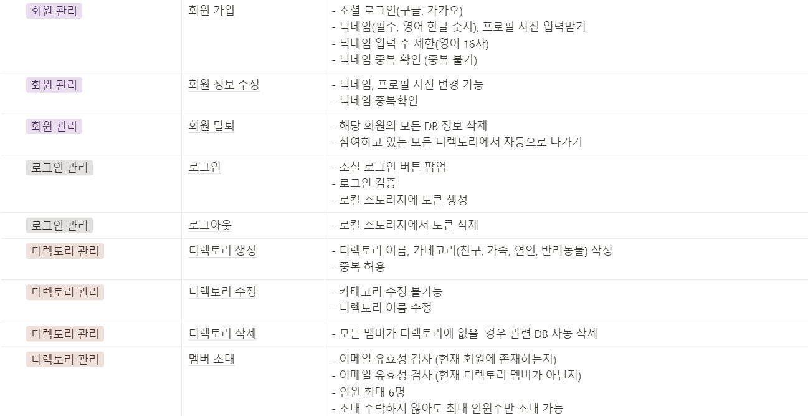


---

### 시스템 아키텍처

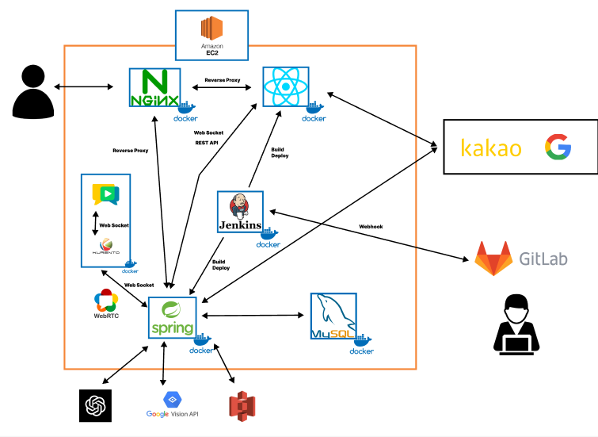

---

### 유저 시나리오

**■ 로그인 및 마이페이지**

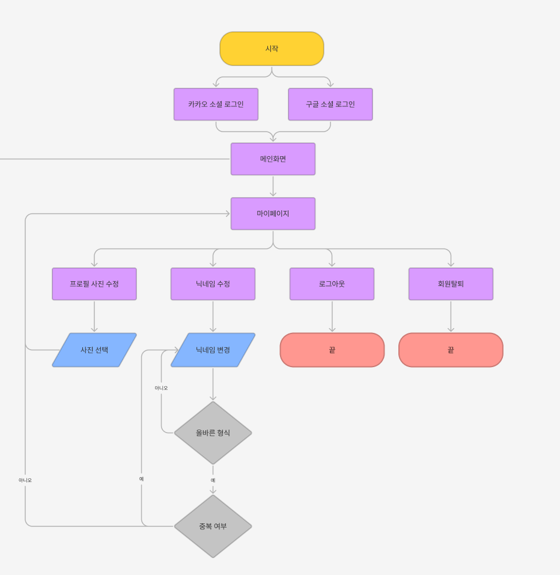

---

**■ 디렉토리 및 퍼즐판 생성**


---

**■ 알림, 게임 및 꾸미기** 


---

### API 명세서

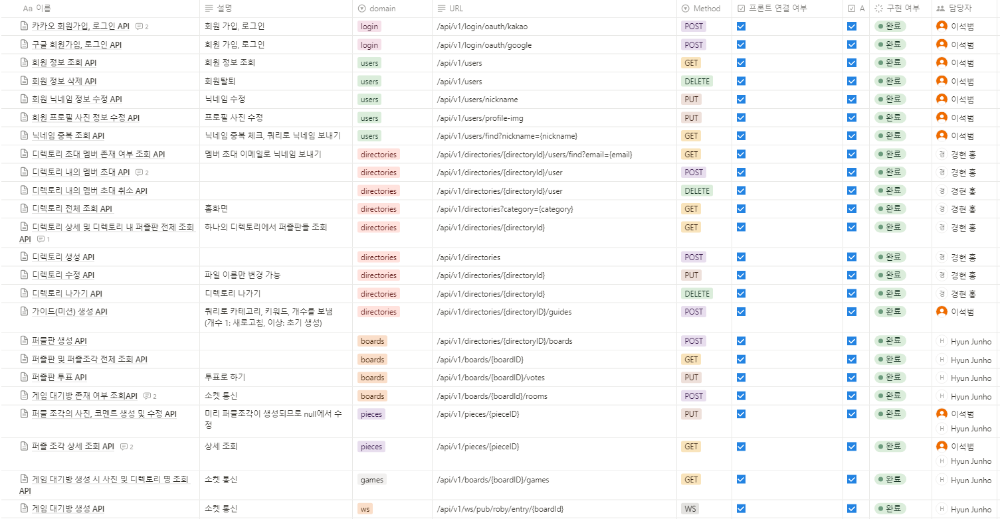

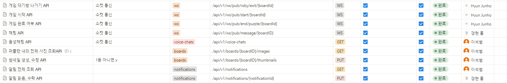

---

### 화면 설계서

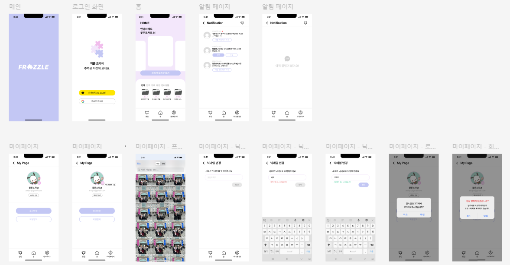

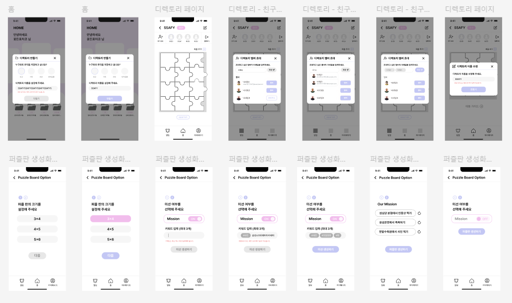

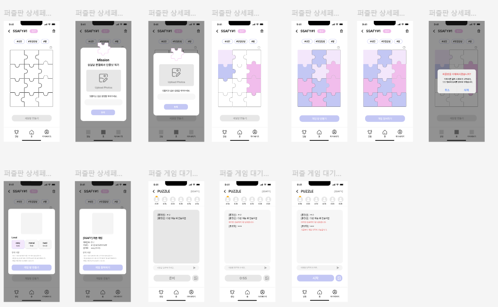

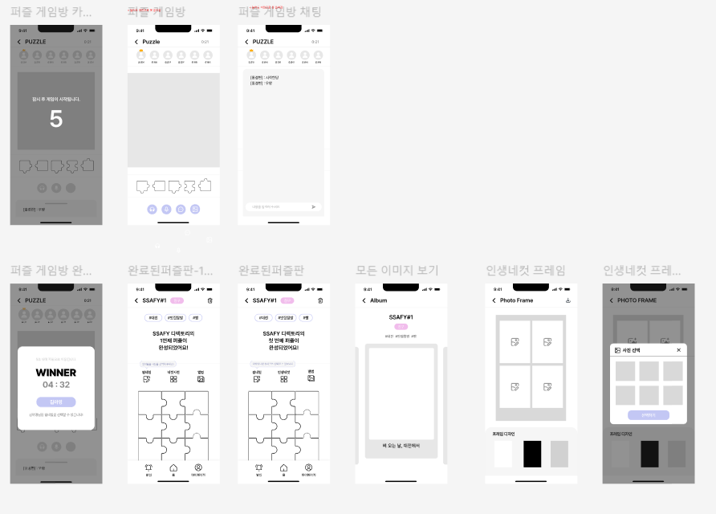

---

### Git Commit 컨벤션

- `feat` : 새로운 기능 추가
- `fix` : 버그 수정
- `docs` : 문서 내용 변경
- `style` : 포맷팅, 세미콜론 누락, 코드 변경이 없는 경우 등
- `design` : 디자인 추가 및 수정
- `refactor` : 코드 리팩토링
- `test` : 테스트 코드 작성
- `chore` : 빌드 수정, 패키지 매니저 설정, 운영 코드 변경이 없는 경우 등

```
[type][FE/BE][developer] subject

ex) 백엔드 회원가입 기능

- [FEAT][BE][석범] 회원가입 기능 추가

```

---

### Git Branch 전략

`git-flow`전략

- `master`
- `develop-front` : FE 배포 브랜치
- `develop-back` : BE 배포 브랜치
- `feature/FE/function1`
- `feature/BE/function2`

### ERD

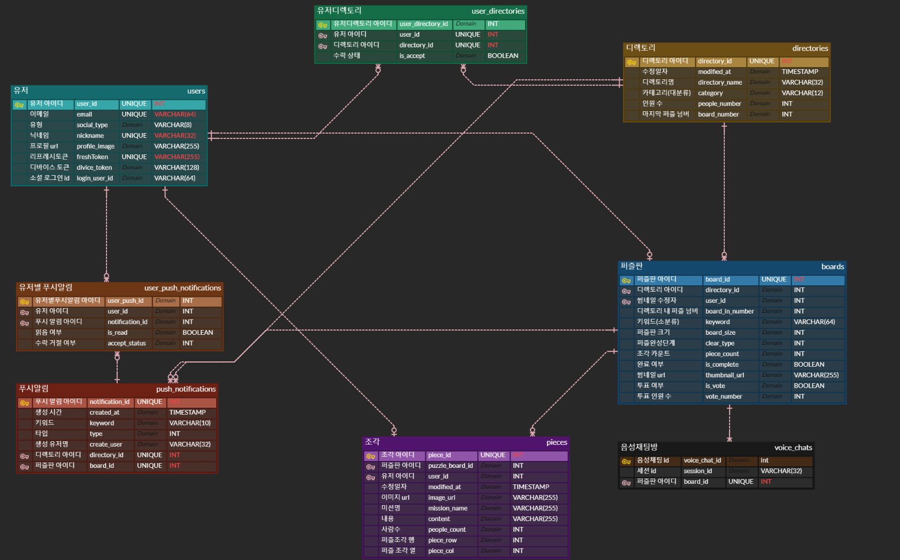

### EC2 포트 정리

| Port |  |
| --- | --- |
| 4443 | Openvidu server |
| 8888 | Kurrento server |
| 80 | Nginx HTTP 기본 포트 |
| 443 | Nginx HTTPS |
| 3306 | Mysql |
| 9090 | Jenkins |
| 3000 | React app |
| 8080 | Spring boot |

### 역할 분배


